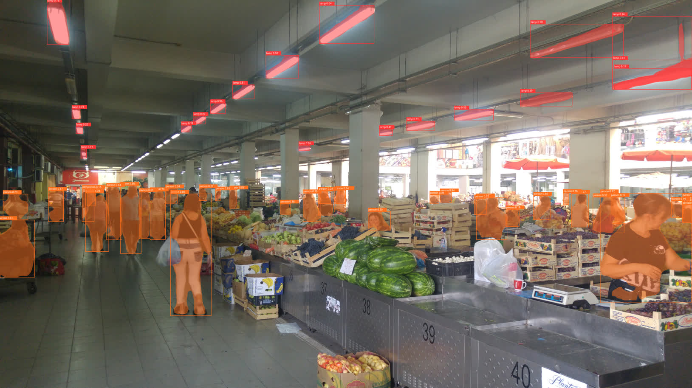
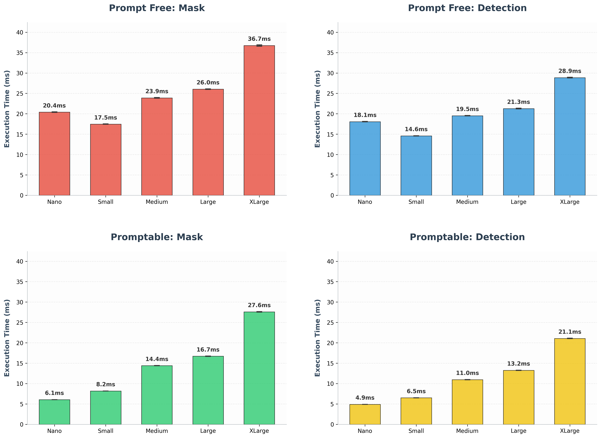
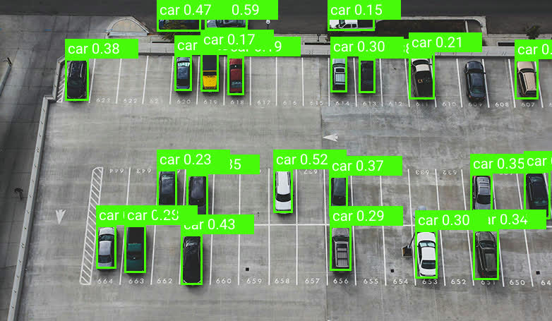
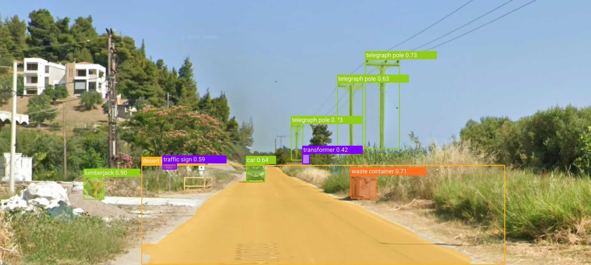
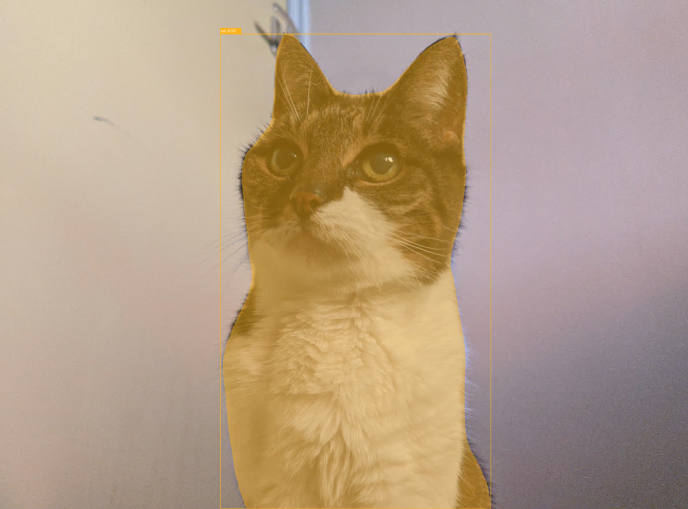

# object_detector

Easy-to-use object detection and instance segmentation in Rust, powered by ONNX Runtime and the YOLOE-26
(Real-Time Seeing Anything) model family.

[](https://crates.io/crates/object_detector)
[](https://docs.rs/object_detector)



`object_detector` allows you to detect and segment virtually any object in an image. It supports two main modes:
**Promptable** (where you describe what to find in text) and **Prompt-Free** (where it uses a built-in vocabulary
of 4,500+ tags).

## Features

- **Open-Vocabulary Detection**: Describe objects using natural language (e.g., "blue toaster", "person with a hat").
- **Built-in Vocabulary**: Detect 4,585 different object categories out-of-the-box in Prompt-Free mode.
- **Instance Segmentation**: Get high-quality pixel-level masks for every detected object.
- **Flexible Scaling**: Choose from 5 model sizes (Nano to XLarge) to balance speed and accuracy.
- **Automatic Model Management**: Models can be automatically downloaded from Hugging Face on the first run.
- **Hardware Acceleration**: Full support for CUDA, TensorRT, CoreML, DirectML, and more via `ort`.
- **Pure Rust API**: Clean, builder-based interface for both initialization and inference.

---

## Quick Start

```rust
use object_detector::{DetectorType, ObjectDetector};
use std::path::Path;

#[tokio::main]
async fn main() -> color_eyre::Result<()> {
    let image_path = Path::new("assets/img/fridge.jpg");
    let img = image::open(image_path)?;

    let mut detector = ObjectDetector::from_hf(DetectorType::PromptFree)
        .build()
        .await?;
    let results = detector.predict(&img).call()?;

    for det in results {
        println!("[{:>10}] Score: {:.4}", det.tag, det.score);
    }

    Ok(())
}
```

## Configuring parameters

The following example demonstrates how to configure the detector using the builder pattern for both initialization and
inference.

```rust
use object_detector::{DetectorType, ModelScale, ObjectDetector};
use ort::ep::CUDA;

#[tokio::main]
async fn main() -> color_eyre::Result<()> {
    let mut detector = ObjectDetector::from_hf(DetectorType::Promptable) // Choose Promptable or PromptFree
        .scale(ModelScale::Large)      // Choose from Nano to XLarge
        .include_mask(true)            // Set to false for faster bounding-box-only detection
        .with_execution_providers(&[
            // Choose execution provider (error_on_failure is optional, it helps detect failure to use EP)
            CUDA::default().build().error_on_failure()
        ])
        .build()
        .await?;

    let img = image::open("assets/img/market.jpg")?;

    let results = detector
        .predict(&img)
        .labels(&["lamp", "person"])   // Only required for Promptable mode
        .confidence_threshold(0.35)    // Filter out low-certainty detections
        .intersection_over_union(0.7)  // Control overlap handling (NMS)
        .call()?;

    for det in results {
        println!("Detected: {} with score {}", det.tag, det.score);
    }

    Ok(())
}
```

## Advanced Usage

### Local Models

If you prefer to manage your own ONNX files or want to skip the Hugging Face integration, you can instantiate the
detectors directly using local paths.

```rust
use object_detector::predictor::{PromptFreeDetector, PromptableDetector};
use open_clip_inference::TextEmbedder;

fn main() -> color_eyre::Result<()> {
    let pf_detector = PromptFreeDetector::builder("path/to/model.onnx", "path/to/vocab.json")
        .build()?;

    Ok(())
}
```

### 2. Processing and Visualizing Results

Each `DetectedObject` contains a bounding box, a score, a class ID, a tag string, and an optional pixel-level mask.

For a complete visualization example using `imageproc` and drawing text/masks onto images,
see [examples/visualize.rs](examples/visualize.rs).*

### Execution Providers (Nvidia, AMD, Intel, Mac, Arm, etc.)

To use hardware acceleration, you must enable the corresponding feature in your `Cargo.toml`.

```toml
[dependencies]
object_detector = { version = "0.2.1", features = ["cuda"] }
```

Then, pass the provider during initialization:

```rust
pub fn main() {
    let detector = ObjectDetector::from_hf(DetectorType::PromptFree)
        .with_execution_providers(&[
            // You can pass multiple execution providers, sorted by priority
            // ORT will try them until one works, otherwise falling back to CPU.
            ort::ep::CUDA::default().build(),
            ort::ep::CoreML::default().build(),
        ])
        .build()
        .await?;
}
```

---

## Model Selection Guide

This crate utilizes **YOLOE-26 (Real-Time Seeing Anything)**, a state-of-the-art open-vocabulary model family built upon
the [Ultralytics YOLO26](https://docs.ultralytics.com/models/yolo26/) architecture. Unlike traditional YOLO models
limited to a fixed set of categories (like COCO's 80 classes), YOLOE-26 can detect and segment virtually any object.

### Performance Benchmarks

The following results demonstrate the execution time (latency) across different scales and modes.



> [!NOTE]
> **Benchmark Environment:** Ryzen 5800X3D CPU | RTX 2080Ti GPU | CUDA Execution Provider.
> For **Promptable** modes, text embeddings (CLIP) are cached, as they would be when performing repeated inference
> during normal use.

### 1. Model Scales: Speed vs. Accuracy

The crate supports five model scales. Choosing the right one depends on your hardware and accuracy requirements:

| Scale          | Parameters | Description                            | Best For                                                  |
|:---------------|:-----------|:---------------------------------------|:----------------------------------------------------------|
| **Nano (N)**   | ~4.8M      | Fastest inference speed.               | Edge devices, mobile applications, and low-power CPUs.    |
| **Small (S)**  | ~13.1M     | Balanced efficiency and accuracy.      | Real-time desktop applications and mid-range IoT devices. |
| **Medium (M)** | ~27.9M     | High accuracy with moderate latency.   | GPU inference where precision is a priority.              |
| **Large (L)**  | ~32.3M     | **(Default)** High-fidelity detection. | Server-side processing and high-precision robotics.       |
| **XLarge (X)** | ~69.9M     | Maximum accuracy available.            | Non-real-time analysis and maximum-precision tasks.       |

### 2. Operating Modes: Prompt-Free vs. Promptable

#### **Prompt-Free Mode (`DetectorType::PromptFree`)**

* **Mechanism:** Uses a built-in vocabulary of **4,585 classes** based on the RAM++ tag set.
* **Characteristics:** This mode is highly efficient as it does not require external text encoding. It functions like a
  traditional YOLO model but with a much larger pre-defined label set.
* **Constraint:** You are limited to the built-in vocabulary; you cannot define custom classes at runtime in this mode.

#### **Promptable Mode (`DetectorType::Promptable`)**

* **Mechanism:** Uses a text-alignment module to compare image features against **CLIP text embeddings**.
* **Characteristics:** This mode provides high flexibility. You can prompt the model with specific strings such as
  `"blue toaster"` or `"peace symbol"`.
* **Constraint:** Requires a CLIP model (handled automatically via `open_clip_inference`) to generate embeddings for
  your labels, which adds a small initial overhead.

### 3. Task Selection: Mask (Segmentation) vs. Detection

You can toggle the `include_mask(bool)` parameter during builder initialization.

* **Instance Segmentation (`include_mask(true)`):** Includes a pixel-level `ObjectMask` for every detected object. This
  is useful for tasks like background removal, object isolation, or precise spatial analysis.
* **Object Detection (`include_mask(false)`):** Returns only the bounding boxes, tags and scores for detected objects.
* **Performance Impact:**
    * On **GPU**, detecting only bounding boxes is approximately **15-33% faster** than segmentation.
    * On **CPU**, the difference is more significant, running up to **2x faster** when masks are disabled.

---

### Understanding Thresholds

Fine-tuning the detection thresholds is essential for balancing precision (reducing false positives) and recall (finding
all objects).

#### **Confidence Threshold (`confidence_threshold`)**

This parameter determines the minimum certainty required for a detection to be returned.

* **Default:** `0.25`
* **Low values (e.g., 0.1):** The model will be more sensitive and detect more objects, but it will also return more "
  noise" or incorrect detections.
* **High values (e.g., 0.7):** The model will only return objects it is very certain about. This reduces false positives
  but may cause it to miss partially obscured or small objects.

#### **Intersection Over Union (`intersection_over_union`)**

This parameter controls the Non-Maximum Suppression (NMS) process, which decides how to handle multiple overlapping
boxes for the same object.

* **Default:** `0.7`
* **Mechanism:** When two boxes overlap significantly, the IOU value measures the ratio of the overlap area to the total
  area of both boxes. If the IOU is higher than your threshold, the box with the lower confidence score is discarded.
* **High values (e.g., 0.8):** More tolerant of overlapping boxes. Useful in crowded scenes where objects are physically
  close to each other.
* **Low values (e.g., 0.3):** More aggressive at removing overlaps. Useful if the model is producing "double" detections
  for a single object.

---

## Cargo Features

| Feature  | Default | Description                                             | Dependencies      |
|:---------|:-------:|:--------------------------------------------------------|:------------------|
| `hf-hub` | **Yes** | Enable automatic model downloading from Hugging Face.   | `hf-hub`, `tokio` |
| `serde`  | **Yes** | Enable `Serialize`/`Deserialize` for detection structs. | `serde`           |

The main `ort` cargo features are also forwarded.

* ORT Cargo features: https://ort.pyke.io/setup/cargo-features
* ORT Execution providers: https://ort.pyke.io/perf/execution-providers

## Troubleshooting

### Link error - ORT

If a link error happens while building, this is probably due to ORT. You can try the `load-dynamic` cargo feature to
resolve this. You'll need to point to an instance of the ONNXRuntime library on your system via an environment variable.
See the next section for more info.

### [When using `load-dynamic` feature] ONNX Runtime Library Not Found

OnnxRuntime is dynamically loaded, so if it's not found correctly, then download the correct onnxruntime library
from [GitHub Releases](http://github.com/microsoft/onnxruntime/releases).

Then put the dll/so/dylib location in your `PATH`, or point the `ORT_DYLIB_PATH` env var to it.

## Output samples

### Car park - no masks - prompted ["car"]



### StreetView - with mask - prompt free



### Cat - with mask - prompted ["cat"]


